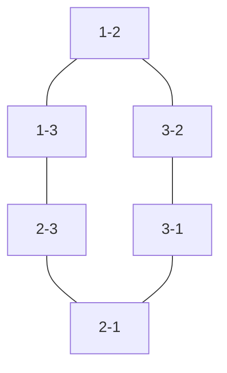

# 8 Puzzle on Graph

[URL](https://atcoder.jp/contests/abc224/tasks/abc224_d)

## アルゴリズムの方針

$9$ 個の頂点に $8$ 個のコマを配置するパターンは全部で $9P8 = 362880$ 通り存在する。

大まかなイメージとして、コマの配置パターンを頂点とする無向グラフを作成して、BFSを用いて開始時点の配置パターンからゴールとなる配置パターンへ遷移するための最小操作回数を求める。

仮に頂点の個数が $3$ 個、コマの個数が $2$ 個の場合、コマの配置パターンは全部で $6$ 通り存在する。

|No. |コマ $1$ |コマ $2$|
|-:|-:|-:|
|1|1|2|
|2|1|3|
|3|2|1|
|4|2|3|
|5|3|1|
|6|3|2|

コマの配置パターンを頂点とした無向グラフはこうなる。実際に遷移可能かは入力で与えられる無効グラフの $M$ 個の辺に依存する。具体的には、 3-1から3-2へ遷移するためには、 辺の中に $(1,2)$ が必要である。

例えば開始地点を3-1とした場合、1-2まで遷移するのに必要な最短経路を求め、それが解となる。

3-1 → 3-2 → 1-2へ遷移可能な場合は $2$ が解で、もし、1-2へ遷移不可能な場合は $-1$ が解となる。

[提出結果](https://atcoder.jp/contests/abc224/submissions/52794122)
