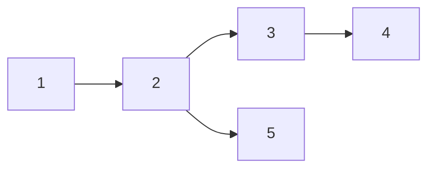

# E - Notebook

[問題URL](https://atcoder.jp/contests/adt_hard_20240430_2/tasks/abc273_e)

## 実装ロジックの概要

「ノートから数列を取り出す。その後、整数 $x$ を末尾に追加する。」という操作が実行される度に、数列 $A$ は枝分かれしていく。この枝分かれを再現するために、単純有向グラフを用いる。

まずは、必要な有向単純グラフと辞書を用意する。

- 単純有向グラフ $GraphA$
- $GraphA$ の全ての辺の向きを逆にした単純有向グラフ $GraphA'$
- ページ番号がKeyで、クエリ番号 $q \ (1 \le q \le Q)$ をValueとした辞書 $Book$
- クエリ番号 $q$ がKeyで、整数 $x$ をValueとした辞書 $Dic$

$GraphA$、$GraphA'$ の頂点に整数 $x$ ではなくクエリ番号 $q$ を追加していく理由は、仮に $GraphA$ の頂点を整数 $x$ で構成したとき、例えば頂点 $2$ を枝分かれさせて新しく頂点 $3$ を追加しようとしても、単純グラフの頂点はUniqueであるため頂点 $3$ を追加できないからである。

一方でクエリ番号 $q$ はUniqueであるためこの場合は枝分かれが可能で、クエリ番号 $q$ から整数 $x$ を取得する辞書を作って出力時に変換すれば良い。

|Key|Value|
|-:|-:|
|1|2|
|2|2|
|3|1|
|4|3|
|5|3|

なお、現在の頂点の位置（整数列 $A$ の末尾）は、各クエリ後に更新しておくこと。

[提出結果](https://atcoder.jp/contests/adt_hard_20240430_2/submissions/52985025)
