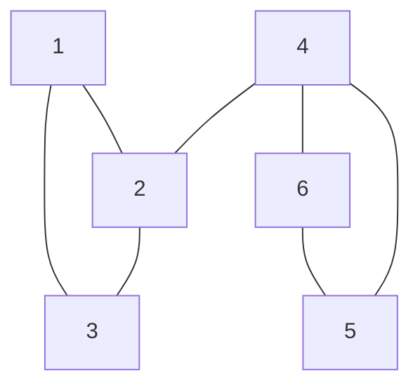
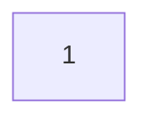
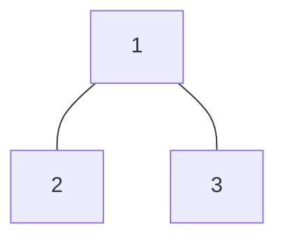
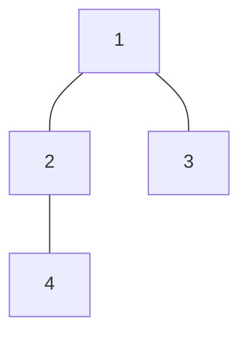
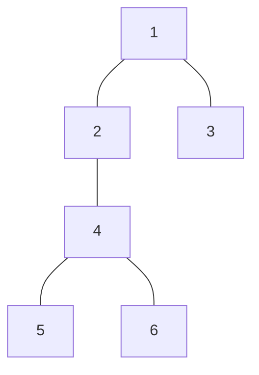
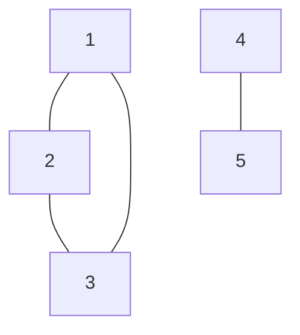

# C - Don’t be cycle

[URL](https://atcoder.jp/contests/abc288/tasks/abc288_c)

入力例1の単純無向グラフを可視化するとこのようになる。



$(1,2,3)$ と $(4,5,6)$ で構成される部分グラフが閉路である。

BFS（幅優先探索）を用いて頂点を移動していく。

そのときに使用した辺の数 $count$ を求める。但し、1度通った頂点は2回以上到達及び通過しない。

答えは $M-count$ となる。

## 頂点移動のイメージ

最初は1にいる。



頂点 $1$ と隣接する頂点に移動する。



一度通った頂点への移動はしないため、$2 \rightarrow 1, 2 \rightarrow 3,3 \rightarrow 1,3 \rightarrow 2$ への移動はしない。

頂点 $4$ はまだ通っていないため、$2 \rightarrow 4$へ移動する。



同様に $4 \rightarrow 5, 4 \rightarrow 6$ へ移動する。



全ての頂点を通ったためここで移動終了。

なお、与えられる入力のグラフは連結でない可能性があるため注意する。

連結でないグラフの例。



[提出結果](https://atcoder.jp/contests/abc288/submissions/52261502)

```csharp title="C#"
using System.Diagnostics;
using System.Text;

public class Program
{
    public static void Main()
    {
        DisableAutoFlush();
        Solve.Run();
        Flush();
    }

    public static class Solve
    {
        public static void Run()
        {
            var inputs = ReadLineInts();
            int iN = inputs[0], iM = inputs[1];
            var iAB = ReadLinesIntMatrix(iM);

            var sug = new Dictionary<int, HashSet<int>>();

            foreach (var ab in iAB)
            {
                sug.TryAdd(ab[0], new HashSet<int>());
                sug.TryAdd(ab[1], new HashSet<int>());
                sug[ab[0]].Add(ab[1]);
                sug[ab[1]].Add(ab[0]);
            }

            var set = new HashSet<int>();
            var count = 0;

            for (int i = 1; i <= iN; i++)
            {
                if (set.Contains(i)) continue;
                set.Add(i);

                var queue = new Queue<int>();
                queue.Enqueue(i);

                while (queue.TryDequeue(out var current))
                    if (sug.TryGetValue(current, out var nexts))
                        foreach (var next in nexts)
                        {
                            if (set.Contains(next)) continue;
                            set.Add(next);
                            count++;
                            queue.Enqueue(next);
                        }
            }

            Console.WriteLine(iM - count);
        }

        // ----------------------------------------------------------------------------------------------------
        // --- Readline
        // ----------------------------------------------------------------------------------------------------
        public static double ReadLineDouble() => double.Parse(ReadLineString());
        public static double[] ReadLineDoubles() => ReadLineStrings().Select(double.Parse).ToArray();
        public static double[] ReadLinesDoubles(int height) => Enumerable.Range(0, height).Select(_ => ReadLineDouble()).ToArray();
        public static double[][] ReadLinesDoubleMatrix(int height) => Enumerable.Range(0, height).Select(_ => ReadLineDoubles()).ToArray();
        public static decimal ReadLineDecimal() => decimal.Parse(ReadLineString());
        public static decimal[] ReadLineDecimals() => ReadLineStrings().Select(decimal.Parse).ToArray();
        public static decimal[] ReadLinesDecimals(int height) => Enumerable.Range(0, height).Select(_ => ReadLineDecimal()).ToArray();
        public static decimal[][] ReadLinesDecimalMatrix(int height) => Enumerable.Range(0, height).Select(_ => ReadLineDecimals()).ToArray();
        public static int ReadLineInt() => int.Parse(ReadLineString());
        public static int[] ReadLineInts() => ReadLineStrings().Select(int.Parse).ToArray();
        public static int[] ReadLinesInts(int height) => Enumerable.Range(0, height).Select(_ => ReadLineInt()).ToArray();
        public static int[][] ReadLinesIntMatrix(int height) => Enumerable.Range(0, height).Select(_ => ReadLineInts()).ToArray();
        public static long ReadLineLong() => long.Parse(ReadLineString());
        public static long[] ReadLineLongs() => ReadLineStrings().Select(long.Parse).ToArray();
        public static long[] ReadLinesLongs(int height) => Enumerable.Range(0, height).Select(_ => ReadLineLong()).ToArray();
        public static long[][] ReadLinesLongMatrix(long height) => Enumerable.Range(0, (int)height).Select(_ => ReadLineLongs()).ToArray();
        public static string ReadLineString() => Console.ReadLine().TrimStart().TrimEnd();
        public static string[] ReadLineStrings() => Console.ReadLine().TrimStart().TrimEnd().Split();
        public static string[] ReadLinesStrings(int height) => Enumerable.Range(0, height).Select(_ => ReadLineString()).ToArray();
        public static string[][] ReadLinesStringMatrix(int height) => Enumerable.Range(0, height).Select(_ => ReadLineStrings()).ToArray();
        public static char[][] ReadLinesCharMatrix(int height) => Enumerable.Range(0, height).Select(_ => ReadLineString().ToCharArray()).ToArray();

        // ----------------------------------------------------------------------------------------------------
        // --- Math
        // ----------------------------------------------------------------------------------------------------

        /// <summary>
        /// Returns a specified number raised to the specified power.
        /// </summary>
        /// <returns>The number x raised to the power y.</returns>
        public static long Pow(long x, int y)
        {
            var pow = 1L;

            for (int i = 0; i < y; i++)
                pow *= x;

            return pow;
        }

        /// <summary>
        /// 割り算する。（切り上げ）
        /// </summary>
        public static long Ceiling(long bloken, long divided) => bloken % divided == 0L ? bloken / divided : bloken / divided + 1L;

        /// <summary>
        /// 割り算する。（切り上げ）
        /// </summary>
        public static int Ceiling(int bloken, int divided) => (int)Ceiling((long)bloken, divided);
    }

    public static void DisableAutoFlush()
    { Console.SetOut(new StreamWriter(Console.OpenStandardOutput()) { AutoFlush = false }); }

    public static void Flush()
    { Console.Out.Flush(); }
}
```
