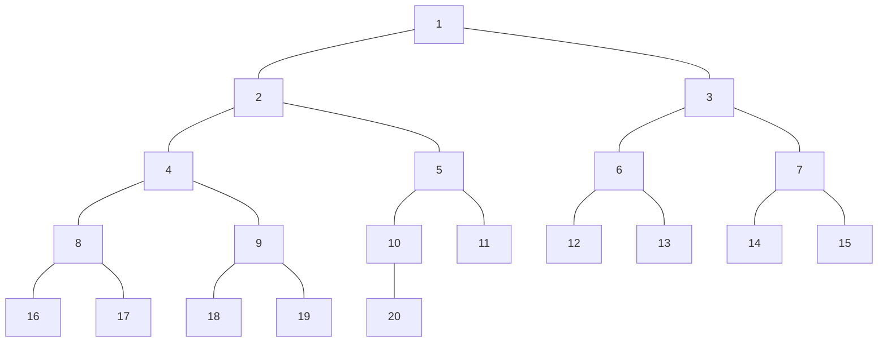
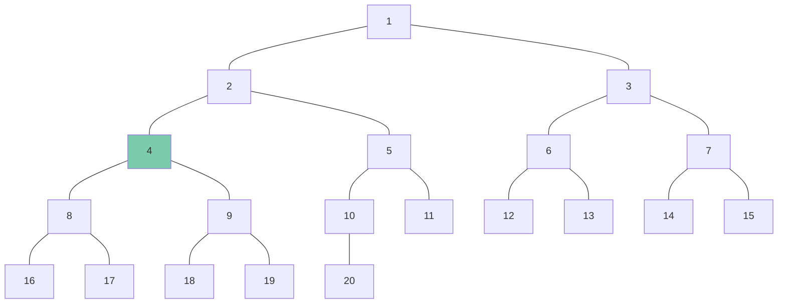
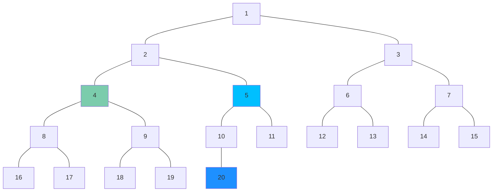
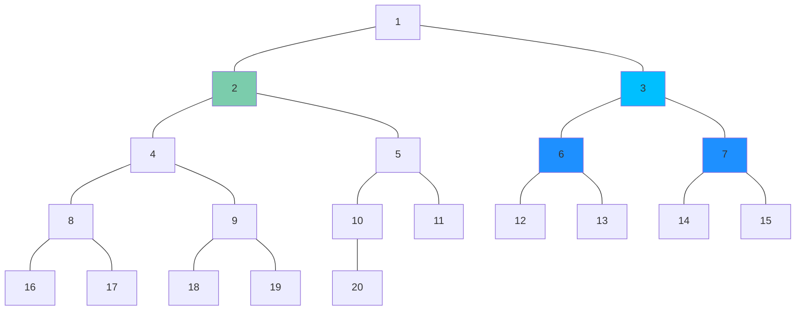
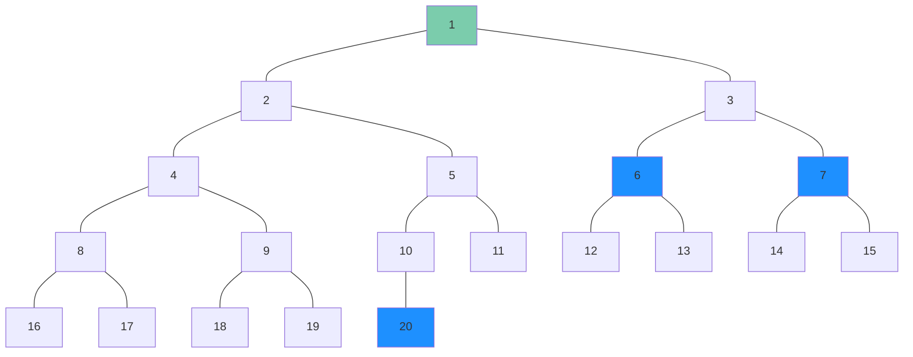
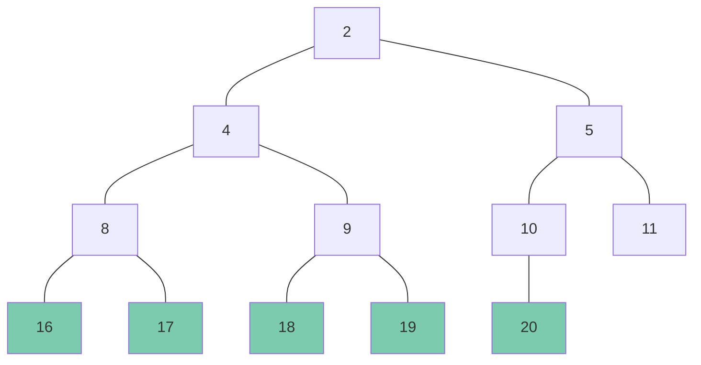

# E - Complete Binary Tree

[URL](https://atcoder.jp/contests/abc321/tasks/abc321_e)

## 方針

まずは、頂点番号 $x$ を根とした部分木の距離 $k$ の頂点の個数を加算する。

続いて、一つ右隣の頂点 $x'$ を根とした部分木における、根から距離 $k-2$ の頂点の個数を加算する。（※）

その後、「完全二分木の根 $1$ に到達、もしくは、距離 $K$ 分だけ移動する」まで、1つ上の階層に移動し、その度に（※）を実行する。

ちょうど距離 $K$ 分だけ移動できた場合は、$1$ を加算する。

### 具体例

与えられたテストケースを $N=20, \ X=4, \ K=4$ とする。



まずは、頂点番号 $4$ を根とした部分木における、根から距離 $4$ の頂点の個数 $0$ を加算する。



続いて、一つ右隣の頂点 $5$ を根とした部分木における、根から距離 $2$ の頂点の個数 $1$ を加算する。



$1$ つ上の階層の頂点 $2$ に移動し、一つ右隣の頂点 $3$ を根とした部分木の距離 $1$ の頂点の個数 $2$ を加算する。



$1$ つ上の階層の頂点 $1$ に移動する。これ以上移動できないため、結果 $3$ を出力する。



### 根 $x$ からの距離 $k$ の頂点の個数の求め方

根 $x$ から距離 $k$ の階層に存在する頂点の最小値を $L$ 、最大値を $R$ とする。$N$ はテストケースで与えられる完全二分木の頂点の個数である。

$$
\begin{equation}
\begin{cases}
N - L + 1 & (L \le N \le R) \\
0 & (N < L \lor R < N)
\end{cases}\nonumber
\end{equation}
$$

頂点の個数が $20$ の完全二分木とした、 $2$ を根とした部分木における、根から距離が $3$ の場合。

$N - L + 1 = 20 - 16 + 1 = 5, \ (16,17,18,19,20)$



```csharp title="C#"
public static long Count(long max, long current, long cnt)
{
    long left = current, right = current;

    while (right < max && 1L <= cnt)
    {
        cnt--;

        left = left * 2L;
        right = right * 2L + 1L;
    }

    if (cnt == 0 && left <= max)
        return Math.Min(max, right) - left + 1L;
    else
        return 0L;
}
```

[提出結果](https://atcoder.jp/contests/abc321/submissions/53017895)
