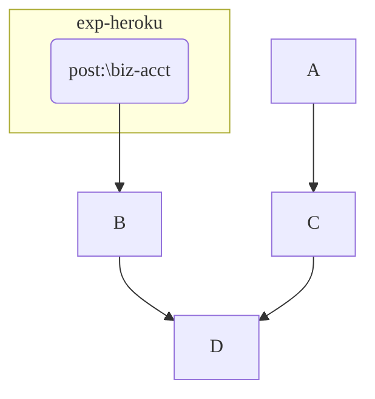

# D - Erase Leaves

[URL](https://atcoder.jp/contests/abc333/tasks/abc333_d)

## ロジック

数列 $ A $ に含まれる $A_i$ の値別に、かつ、昇順で累積和 $cs$ を作成する。また、数列 $A$ の全ての要素の合計 $total$ を求める。

また、 $f(A_i)$ を累積和 $cs$ から $A_i$ の値に対応する和とする。

各 $i$ について、 $total$ から $f(A_i)$ を引いた値が答えとなる。

$$
total - f(A_i) \quad (1 \le i \le N)
$$

$total$ の代わりに $f(A_N)$ を使用しても良い。

$$
f(A_N) - f(A_i) \quad (1 \le i \le N)
$$

### 参考

入力例1の場合の累積和のイメージ

| $A_i$ の値|1|2|4|
|-|-:|-:|-:|
|和|2|4|12|

累積和 $cs$ は辞書型で実装する。

[提出結果](https://atcoder.jp/contests/abc331/submissions/52384112)

```csharp title="C#"
```


