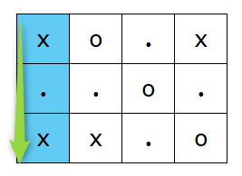
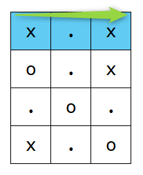

# D - Cheating Gomoku Narabe

[URL](https://atcoder.jp/contests/abc337/tasks/abc337_d)

## 解法

縦方向と横方向が存在するが、グリッド $S$ の行と列を入れ替えたグリッドを $S'$ とし、 $S$ と $S'$ 両方に対して、横方向のチェックをすれば良い。

**入力例 1のグリッドの縦方向**



**行と列を入れ替えると、元のグリッドの縦方向は横方向になる**



縦方向と横方向を入れ替えるコードの例

```csharp
var is2 = Matrix<char>.Create(iW, iH);

for (int h = 0; h < iH; h++)
    for (int w = 0; w < iW; w++)
        is2[w][h] = iS[h][w];
```

以後、横方向のみを考えることにする。

任意の行 $h$ において全ての連続した $K$ 個のマスにおける `o`、`x`、`.` それぞれの個数は、Dictionaryを使用すると $O(W)$ で取得可能である。

まずはDictionaryを定義する。

```csharp
var dic = new Dictionary<char, int>
{
    { 'o', 0 },
    { 'x', 0 },
    { '.', 0 }
};
```

その後、行 $h$ に対して全ての連続した $K$ 個のマスにおける　`ox.` の個数をカウントする。

```csharp
# wを左端（0)から右端(iS[0].Length - 1)へ移動していく。
for (int w = 0; w < iS[0].Length; w++)
{
    # wがK以上の場合は、K個前に存在する文字の個数を1減らす。
    if (iK <= w)
        dic[iS[h][w - iK]]--;

    # wの地点の文字を1増やす。
    dic[iS[h][w]]++;

    # wがK未満の場合は連続したK個となっていないため、次のループに進む。
    if (w < iK - 1)
        continue;

    # xの個数が0でない場合は対象外であるため、次の処理に進む。
    if (dic['x'] != 0)
        continue;

    # ｘの個数が0である場合はKからoの個数を引いた数が、全てoにするための操作回数となる。
    min = Math.Min(min, iK - dic['o']);
}
```

この処理を全ての行に対して実施すればOKで、総計算量は $O(HW)$ となる。

[提出結果](https://atcoder.jp/contests/abc337/submissions/59456100)
